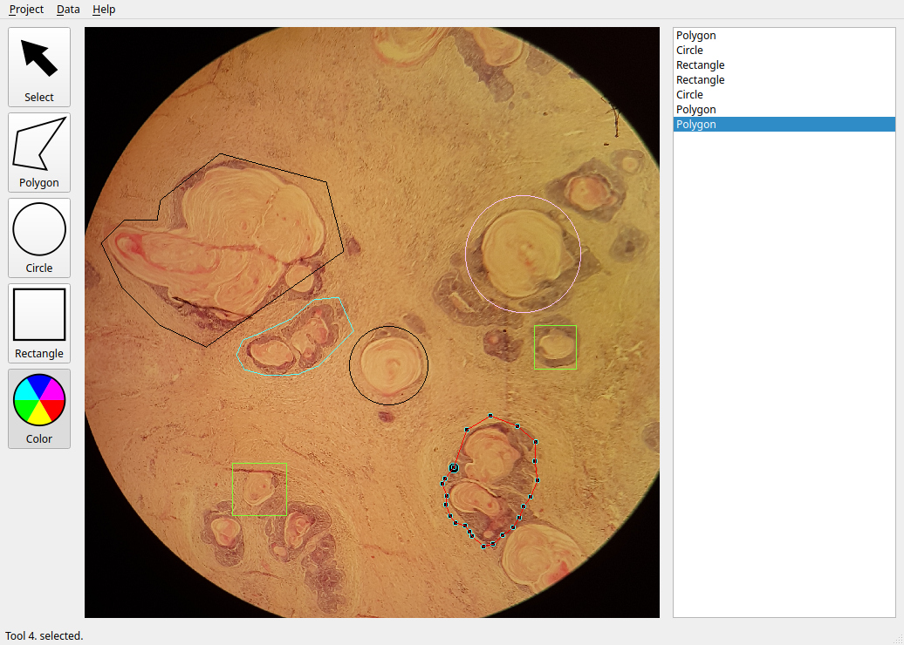
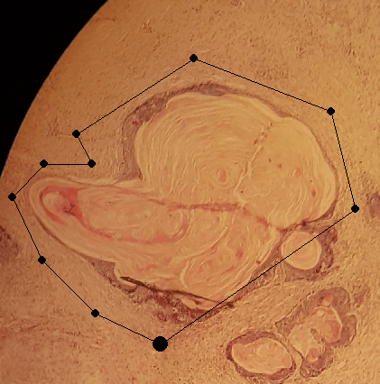

# CGPicker
Prototype of tool for drawing vector graphics on images

Features:
- drawing shapes like: rectangles, polygons, ellipses
- resize, move vertices of existing shapes
- saving shapes in binary file
- load background images

